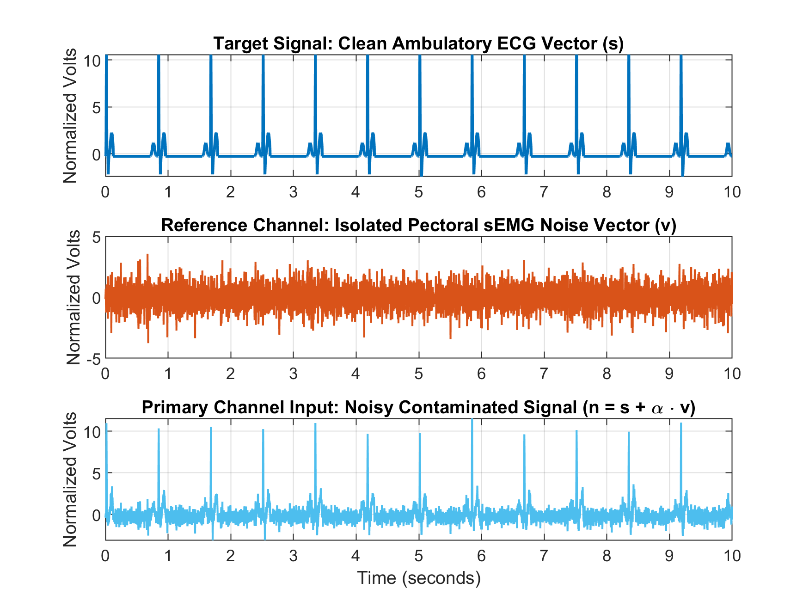

# Adaptive Noise Canceling

## Objectives
1. Develop a signal representing a "noisy" heartbeat signal similar to what a sEMG setup would read.  
### 2. Develop an Adaptive Noise Canceling (ANC) filter and test it on a "noisy" heartbeat signal.  
3. Analyze and improve the ANC filter by optimizing the signal-to-noise ratio.

---

## 2. Develop an Adaptive Noise Canceling (ANC) filter and test it on a "noisy" heartbeat signal. 

### (i) Initializing the Filters

```matlab
M       = 32;       % Filter order
mu      = 0.01;     % Step size
epsilon = 1e-5;     % NLMS regularization to prevent divide-by-zero
Total_Samples = length(d);

% Pre-allocate output arrays
e_lms       = zeros(Total_Samples, 1);
y_lms       = zeros(Total_Samples, 1);
W_lms       = zeros(M, 1);

e_nlms      = zeros(Total_Samples, 1);
y_nlms      = zeros(Total_Samples, 1);
W_nlms      = zeros(M, 1);

e_lms_gated = zeros(Total_Samples, 1);
y_lms_gated = zeros(Total_Samples, 1);
W_lms_gated = zeros(M, 1);
```
### (ii) Developing the QRS-Gating Logic (Creating the Freeze)

```matlab
% Build the Real-Time Freeze Mask
r_thresh   = 4.0;                   % Threshold in normalized units
min_dist   = round(0.3 * Fs);       % Minimum 300ms between beats (max ~200 BPM)
[~, locs]  = findpeaks(d, 'MinPeakHeight', r_thresh, 'MinPeakDistance', min_dist);

% Define the Freeze Window to be Around the R-peak
pre_samples  = round(0.020 * Fs);   % 20ms  = 7 samples  @ 360 Hz
post_samples = round(0.130 * Fs);   % 130ms = 47 samples @ 360 Hz

freeze_mask = false(Total_Samples, 1);
for k = 1:length(locs)
    i_start = max(1, locs(k) - pre_samples);
    i_end   = min(Total_Samples, locs(k) + post_samples);
    freeze_mask(i_start:i_end) = true;
end
```

### (iii) The Adaptive Filtering Loop

```matlab
% Combined Filter Execution Loop
for n = M:Total_Samples
    X_n = v(n:-1:n-M+1);   % Delay-line window from reference channel

    %% Standard LMS (ungated -- may have ST distortion)
    y_lms(n) = W_lms' * X_n;
    e_lms(n) = d(n) - y_lms(n);
    W_lms    = W_lms + 2 * mu * e_lms(n) * X_n;

    %% Normalized LMS (Self-stabilizing step-size via power normalization)
    mu_n      = mu / (norm(X_n)^2 + epsilon);
    y_nlms(n) = W_nlms' * X_n;
    e_nlms(n) = d(n) - y_nlms(n);
    W_nlms    = W_nlms + 2 * mu_n * e_nlms(n) * X_n;

    %% QRS-Gated LMS (Freezes updates during high-energy transients)
    y_lms_gated(n) = W_lms_gated' * X_n;
    e_lms_gated(n) = d(n) - y_lms_gated(n);
    if ~freeze_mask(n)
        W_lms_gated = W_lms_gated + 2 * mu * e_lms_gated(n) * X_n;
    end
end
```

### (iv) Evaluating Filter Performance (Separating into In-QRS and Out-of-QRS)

```matlab
% Using Phase Calculation to Determine In-QRS v. Out-of-QRS
qrs_analysis_mask = false(Total_Samples, 1);
for i = 1:Total_Samples
    phase = mod(t(i), 1/freq) * freq;
    if phase < 0.15   % R-wave through end of T-wave region
        qrs_analysis_mask(i) = true;
    end
end

% Exclude Samples 1 to M-1 for Best Filter Execution
valid   = false(Total_Samples, 1);
valid(M:end) = true;
in_qrs  = qrs_analysis_mask & valid;
out_qrs = ~qrs_analysis_mask & valid;

% MSE of each filter output vs. ground truth s in each region
calc_mse = @(e, mask) mean((s(mask) - e(mask)).^2);
snr_db   = @(mse_f, mse_i) 10 * log10(mse_i / mse_f);

mse_ref_in  = mean((s(in_qrs)  - d(in_qrs)).^2);
mse_ref_out = mean((s(out_qrs) - d(out_qrs)).^2);
```
### (v) Results

